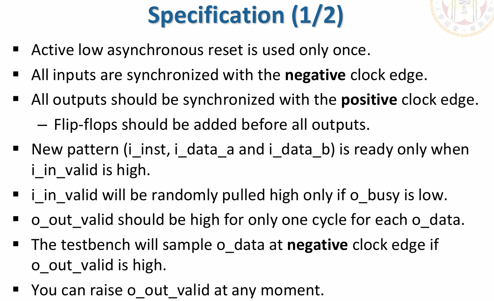

# ComputerAidedVLSIDesign

## Project1: Arithmetic Logic Unit
Specification:

## Project2:  Simple RISC-V CPU
Specification:

## Project3: Simple Convolution and Image Processing Engine
Specification:

## Project4: IoT Data Filtering
Specification:

## Project5: APR
Specification:

Result Highlight:

